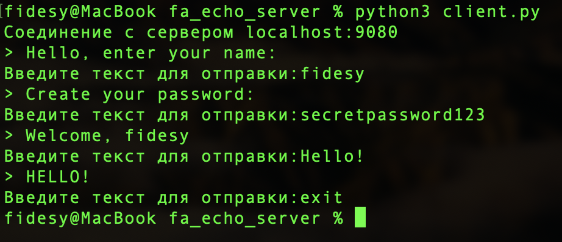
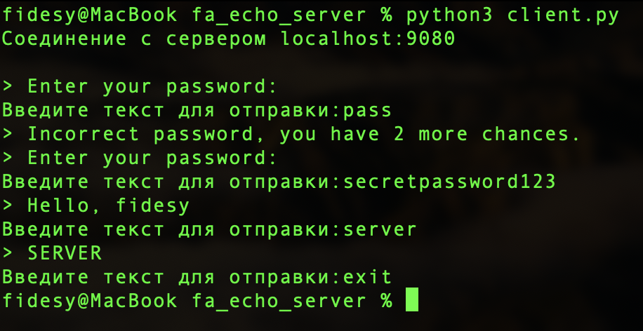

# fa_echo_server

Реализованы все базовые функции.

Дополнительные задания:

1. При вводе строки "exit" клиент отключается от сервера.
2. При разрыве соединения с клиентом сервер продолжает слушать порт, доступен для повторного подключения.
3. Все служебные сообщения записываются в [log файл](./Logs/server.log)
4. Автоматическая замена порта сервера при недоступности введенного.
5. Реализация сервера идентификации. Если IP адрес неизвестен, то сервер запрашивает имя и записывает в базу данных (sqlite).
6. Реализация сервера аутентификации. Если IP адрес известен, то запрашивается пароль, иначе производится процесс регистрации пользователя. Пароли хранятся в виде хэша.

---

Первое подключение клиента к серверу. 
Сервер запрашивает имя и пароль для создания пользователя. После приветствует и начинает работу.

---

При повторных подключениях сервер запрашивает только пароль, так как IP адрес известен и записан в базе данных. Если аутентификация прошла успешно, то сервер приветствует клиента по имени.

